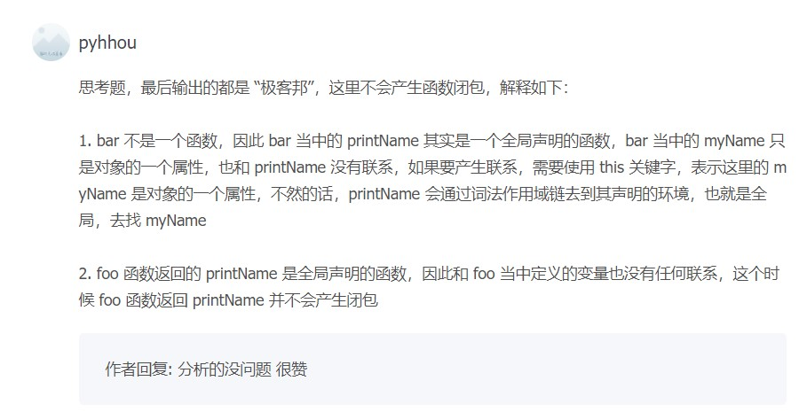

# 浏览器工作原理与时间

---

[TOC]
## 宏观视角下的浏览器


#### chrome架构：打开一个页面为什么有4个进程


#### TCP协议：如何保证页面文件能被完整送达浏览器？


#### HTTP请求流程：为什么很多站点第二次打开速度会很快？

#### 导航流程：从输入URL到页面展示，这中间发生了什么？

<br />

----
#### 渲染流程（上）：HTML、CSS和JavaScript，是如何变成页面的？

##### 构建DOM树

原因：将HTML转为浏览器可理解的结构——DOM树


通过 JavaScript修改DOM
```HTML
document.getElementsByTagName("p")[0].innerText = "black"
```


##### 样式计算
1. 把 CSS 转换为浏览器能够理解的结构 ———— StyleSheets，控制台输入`document.StyleSheets`可以查看


2. 转换样式表中的属性值，使其标准化 ———— 消除不同解析引擎的差异


3. 计算出 DOM 树中每个节点的具体样式


##### 布局阶段
现在，我们有 DOM 树和 DOM 树中元素的样式，但这还不足以显示页面，因为我们还不知道 DOM 元素的几何位置信息。那么接下来就`需要计算出 DOM 树中可见元素的几何位置`，我们把这个计算过程叫做`布局`。

> Chrome 在布局阶段需要完成两个任务：创建布局树和布局计算

1. 构建布局树 ———— 仅包含可见元素


2. 布局计算
根据上面构建的布局树，计算每个节点的坐标位置；


##### 小结


##### 思考题
> 给你留个思考题：如果下载 CSS 文件阻塞了，会阻塞 DOM 树的合成吗？会阻塞页面的显示吗？

作者回复: 借这里解答下留的题目：

当从服务器接收HTML页面的第一批数据时，DOM解析器就开始工作了，在解析过程中，如果遇到了JS脚本，如下所示：
<html>
    <body>
        极客时间
        <script>
        document.write("--foo")
        </script>
    </body>
</html>
那么DOM解析器会先执行JavaScript脚本，执行完成之后，再继续往下解析。

那么第二种情况复杂点了，我们内联的脚本替换成js外部文件，如下所示：
<html>
    <body>
        极客时间
        <script type="text/javascript" src="foo.js"></script>
    </body>
</html>
这种情况下，当解析到JavaScript的时候，会先暂停DOM解析，并下载foo.js文件，下载完成之后执行该段JS文件，然后再继续往下解析DOM。这就是JavaScript文件为什么会阻塞DOM渲染。

我们再看第三种情况，还是看下面代码：
```js
<html>
    <head>
        <style type="text/css" src = "theme.css" />
    </head>
    <body>
        <p>极客时间</p>
        <script>
            let e = document.getElementsByTagName('p')[0]
            e.style.color = 'blue'
        </script>
    </body>
</html>
```
当我在JavaScript中访问了某个元素的样式，那么这时候就需要等待这个样式被下载完成才能继续往下执行，所以在这种情况下，CSS也会阻塞DOM的解析。


所以JS和CSS都有可能会阻塞DOM解析，关于详细信息我们会在后面的章节中详细介绍。

<br />

---
#### 渲染流程（下）：HTML、CSS和JavaScript，是如何变成页面的？

##### 分层
> 为页面中有很多复杂的效果，如一些复杂的 3D 变换、页面滚动，或者使用 z-indexing 做 z 轴排序等，为了更加方便地实现这些效果，渲染引擎还需要为特定的节点生成专用的图层，并生成一棵对应的==图层树（LayerTree）==

> 要想直观地理解什么是图层，你可以打开 Chrome 的“开发者工具”，选择“Layers”标签，就可以可视化页面的分层情况

> 渲染引擎给页面分了很多图层，这些图层按照一定顺序叠加在一起，就形成了最终的页面

> 现在你知道了浏览器的页面实际上被分成了很多图层，这些图层叠加后合成了最终的页面。下面我们再来看看这些图层和布局树节点之间的关系，如文中图所示：


渲染引擎创建特定的图层需要满足以下两个条件之一：
- 拥有层叠上下文属性的元素会被提升为单独的一层：如定位属性{==z-index/position: absolute==}、定义透明属性的元素、使用css滤镜的元素（filter)
层叠上下文参考[该文章](https://developer.mozilla.org/zh-CN/docs/Web/CSS/CSS_Positioning/Understanding_z_index/The_stacking_context)
- 需要裁剪（clip）的地方也会被创建为图层：这里指的是在一个较小的块中需要展示的文本超过了块的可视区域，这时候就会发生，如下图所示


##### 图层绘制
渲染引擎会把图层的绘制拆分为多个小的绘制指令（如绘制点、线、矩形等），然后把这些指令按照顺序组成一个绘制列表；图层绘制阶段输出的是待绘制列表；


##### 栅格化操作
上面提到了图层绘制只是生成并输出待绘制列表，时机的绘制操作是由渲染引擎中的合成线程来完成的，绘制列表准备好后，会`commit`给合成线程；


合成线程首先会将图层划分为图块(`tile`)，然后将这些图块生成位图，生成位图的操作称为栅格化；视口附近的图会优先生成位图；

> 渲染进程维护了一个栅格化线程池，图块的栅格化操作都在线程池内运行；


通常，栅格化过程会使用GPU加速生成，称作GPU栅格化，生成的位图保存在GPU内存中；


##### 合成与显示
> 一旦所有图块都被光栅化，合成线程就会生成一个绘制图块的命令——“DrawQuad”，然后将该命令提交给浏览器进程。

> 浏览器进程里面有一个叫 viz 的组件，用来接收合成线程发过来的 DrawQuad 命令，然后根据 DrawQuad 命令，将其页面内容绘制到内存中，最后再将内存显示在屏幕上。

##### 小结


结合上图，一个完整的渲染流程大致可总结为如下：
1. 渲染进程将 HTML 内容转换为能够读懂的 DOM 树结构；
2. 渲染引擎将 CSS 样式表转化为浏览器可以理解的 styleSheets，计算出 DOM 节点的样式；
3. 创建布局树，并计算元素的布局信息。
4. 对布局树进行分层，并生成分层树。
5. 为每个图层生成绘制列表，并将其提交到合成线程。
6. 合成线程将图层分成图块，并在光栅化线程池中将图块转换成位图。
7. 合成线程发送绘制图块命令 DrawQuad 给浏览器进程。
8. 浏览器进程根据 DrawQuad 消息生成页面，并显示到显示器上。

###### 重绘


###### 重排


###### 直接合成阶段
渲染引擎将跳过布局和绘制，只执行后续的合成操作，我们把这个过程叫做合成。比如添加css3动画属性等；


##### 相关思考
###### 重绘重排与性能优化
减少重排重绘, 方法很多：
1. 使用 class 操作样式，而不是频繁操作 style
2. 避免使用 table 布局
3. 批量dom 操作，例如 createDocumentFragment，或者使用框架，例如 React
4. Debounce window resize 事件
5. 对 dom 属性的读写要分离
6. will-change: transform 做优化

###### 渲染流程补充


1. 渲染进程的合成线程执行图层合成（Layer Compositor）———— 是将多个`tile`合成一个图层
2. 合成的图层交给浏览器进程执行显示合成（Display Compositor）———— 将多个图层合成页面

---

## 浏览器中的JavaScript执行机制

#### 07 | 变量提升：JavaScript代码是按顺序执行的吗？

##### 变量提升
> 所谓的变量提升，是指在 JavaScript 代码执行过程中，JavaScript 引擎把变量的声明部分和函数的声明部分提升到代码开头的“行为”。变量被提升后，会给变量设置默认值，这个默认值就是我们熟悉的 undefined。


通过这段模拟的变量提升代码，相信你已经明白了可以在定义之前使用变量或者函数的原因——函数和变量在执行之前都提升到了代码开头。

##### JavaScript代码的执行流程

> 从概念的字面意义上来看，“变量提升”意味着变量和函数的声明会在物理层面移动到代码的最前面，正如我们所模拟的那样。但，这并不准确。`实际上变量和函数声明在代码里的位置是不会改变的，而且是在编译阶段被 JavaScript 引擎放入内存中`。对，你没听错，一段 JavaScript 代码在执行之前需要被 JavaScript 引擎编译，编译完成之后，才会进入执行阶段。大致流程你可以参考下图：


###### 编译阶段
编译阶段输入代码经过编译后会生成两部分 ———— `执行上下文`和`可执行代码`

`执行上下文是JavaScript执行一段代码的运行环境`比如调用一个函数，就会进入这个函数的执行上下文，确定该函数在执行期间用到的诸如 this、变量、对象以及函数等。

在执行上下文中存在一个变量环境的对象（Viriable Environment），该对象中保存了变量提升的内容。

```js

showName()
console.log(myname)
var myname = '极客时间'
function showName() {
    console.log('函数showName被执行');
}
```

以上面的代码为例，分析环境变量对象的生成过程；
1. 第 1 行和第 2 行，由于这两行代码不是声明操作，所以 JavaScript 引擎不会做任何处理；
2. 第 3 行，由于这行是经过 var 声明的，因此 JavaScript 引擎将在环境对象中创建一个名为 myname 的属性，并使用 undefined 对其初始化；
3. 第 4 行，JavaScript 引擎发现了一个通过 function 定义的函数，所以它将函数定义`存储到堆 (HEAP）`中，并在环境对象中创建一个 showName 的属性，然后将该属性值指向堆中函数的位置（不了解堆也没关系，JavaScript 的执行堆和执行栈我会在后续文章中介绍）。

生成的变量环境可以看做如下结构：
```
VariableEnvironment:
     myname -> undefined, 
     showName ->function : {console.log(myname)
```

生成变量环境对象后，JS引擎会将声明以外的代码编译为字节码，即可执行代码；
```js
showName()
console.log(myname)
myname = '极客时间'
```

###### 执行阶段
1. 当执行到 showName 函数时，JavaScript 引擎便开始在变量环境对象中查找该函数，由于变量环境对象中存在该函数的引用，所以 JavaScript 引擎便开始执行该函数，并输出“函数 showName 被执行”结果。
2. 接下来打印“myname”信息，JavaScript 引擎继续在变量环境对象中查找该对象，由于变量环境存在 myname 变量，并且其值为 undefined，所以这时候就输出 undefined。
3. 接下来执行第 3 行，把“极客时间”赋给 myname 变量，赋值后变量环境中的 myname 属性值改变为“极客时间”，变量环境如下所示：
```
VariableEnvironment: 
    myname -> "极客时间",
    showName ->function : {console.log(myname)
```

> 实际上，编译阶段和执行阶段都是非常复杂的，包括了`词法分析、语法解析、代码优化、代码生成`等，这些内容我会在《14 | 编译器和解释器：V8 是如何执行一段 JavaScript 代码的？》那节详细介绍，在本篇文章中你只需要知道 JavaScript 代码经过编译生成了什么内容就可以了

###### 关于同名变量和函数的处理原则
1. 如果是同名的函数，JavaScript编译阶段会选择最后声明的那个。

2. 如果变量和函数同名，那么在编译阶段，变量的声明会被忽略


##### 总结
1. JavaScript 代码执行过程中，需要先做变量提升，而之所以需要实现变量提升，是因为 JavaScript 代码在执行之前需要先编译。
2. 在编译阶段，变量和函数会被存放到变量环境中，变量的默认值会被设置为 undefined；在代码执行阶段，JavaScript 引擎会从变量环境中去查找自定义的变量和函数。
3. 如果在编译阶段，存在两个相同的函数，那么最终存放在变量环境中的是最后定义的那个，这是因为后定义的会覆盖掉之前定义的。

这节的主要目的是让你清楚`JavaScript 的执行机制：先编译，再执行`。

#### 扩展 ———— [Quick Tip: How to Declare Variables in JavaScript](https://www.sitepoint.com/how-to-declare-variables-javascript/)


###### Declaration
在指定的作用域内声明一个变量

###### Initialization
为变量分配内存：当你声明一个变量时，它会自动初始化，JavaScript引擎会为该变量分配内存

###### Assignment
为变量赋值


##### var

起始于JavaScript创建，作用于全局作用域和函数作用域

```js
var x; // Declaration and initialization
x = "Hello World"; // Assignment

// Or all in one
var y = "Hello World";
```

##### let

ES6引入`let`和`const`，用于降低`var`声明的缺陷（容易造成变量值难以确定及变量污染），作用域增加了块级作用域；

```js
let x; // Declaration and initialization
x = "Hello World"; // Assignment

// Or all in one
let y = "Hello World";
```

Demo说明
```js
var name = "Peter";
if(name === "Peter"){
  let hello = "Hello Peter";
} else {
  let hello = "Hi";
}
console.log(hello); // ReferenceError: hello is not defined


var name = "Peter";
if(name === "Peter"){
  let hello = "Hello Peter";
  console.log(hello);
} else {
  let hello = "Hi";
  console.log(hello); // 正常运行
}
```

##### const

> const用于声明一个常量，即在声明时赋值但不能在函数结束运行前改变它的值，否则会报错；
```js
const x = 'Hello World';
```

##### 意外的全局创建
如果你在赋值前忘记声明该变量，该变量就会被创建为全局变量；为了避免这种情况，可以开启严格模式`use strict`;
```js
function sayHello(){
  hello = "Hello World";
  return hello;
}
sayHello();
console.log(hello); // Hello World
```

##### 变量提升和暂时性死区（Hoisting and Temperal Dead Zone）

> `var`与`let/const`的另一个区别是变量提升，`let/const`不存在变量提升，但存在暂时性死区

变量声明将始终在内部被提升(移动)到当前作用域的顶部，是全局作用域和函数作用域

在声明前访问一个`var`变量会返回`undefined`，这是在初始化的时候赋值的

在声明前访问一个`let/const`变量会报错，在进入变量的作用域和到达其声明之间的这段时间被称为`暂时性死区`，该时间段内变量不可访问


<br />

#### 08 | 调用栈：为什么JavaScript代码会出现栈溢出？

> JavaScript执行过程中可能存在多个执行上下文（Excution Context），JS引擎是通过栈来管理这些EC，称作`调用栈`

```js
var a = 2
function add(b,c){
  return b+c
}
function addAll(b,c){
var d = 10
result = add(b,c)
return  a+result+d
}
addAll(3,6)
```


> 调用栈是 JavaScript 引擎追踪函数执行的一个机制，当一次有多个函数被调用时，通过调用栈就能够追踪到哪个函数正在被执行以及各函数之间的调用关系。


执行时各EC会依次出栈


##### 开发中利用好调用栈
###### 利用浏览器查看调用栈的信息
打开“开发者工具”，点击“Source”标签，选择 JavaScript 代码的页面，然后在第 3 行加上断点，并刷新页面。你可以看到执行到 add 函数时，执行流程就暂停了，这时可以通过右边“call stack”来查看当前的调用栈的情况，如下图：


> 另外，可以通过`console.trace()进行控制台输出函数调用关系


##### 栈溢出
调用栈是有大小的，当栈中的执行上下文超过一定数目时就会造成JS引擎报错，称为栈溢出


##### 总结
1. 每调用一个函数，JavaScript 引擎会为其创建执行上下文，并把该执行上下文压入调用栈，然后 JavaScript 引擎开始执行函数代码。
2. 如果在一个函数 A 中调用了另外一个函数 B，那么 JavaScript 引擎会为 B 函数创建执行上下文，并将 B 函数的执行上下文压入栈顶。
3. 当前函数执行完毕后，JavaScript 引擎会将该函数的执行上下文弹出栈。
4. 当分配的调用栈空间被占满时，会引发“堆栈溢出”问题。


<br />

#### 09 | 块级作用域：var缺陷以及为什么要引入let和const？

> 正是由于 JavaScript 存在`变量提升`这种特性，从而导致了很多与直觉不符的代码，这也是 JavaScript 的一个重要设计缺陷。


##### 主要内容
- 探病因：分析为什么JS中会存在变量提升
- 开药方：如何通过块级作用域和`let/const`修复这种设计缺陷

##### 为什么JS中存在变量提升

这需要从`作用域`讲起，作用域决定了变量与函数的可访问范围，控制着变量与函数的可见性和生命周期；

> 其他语言普遍支持`块级作用域`，而JS在ES6之前，只支持`全局作用域`和`函数作用域`，不支持`块级作用域`

> 和 Java、C/C++ 不同，ES6 之前是不支持块级作用域的，因为当初设计这门语言的时候，并没有想到 JavaScript 会火起来，所以只是按照最简单的方式来设计。没有了块级作用域，再把作用域内部的变量统一提升无疑是最快速、最简单的设计，不过这也直接导致了函数中的变量无论是在哪里声明的，在编译阶段都会被提取到执行上下文的变量环境中，所以这些变量在整个函数体内部的任何地方都是能被访问的，这也就是 JavaScript 中的变量提升。

> 全局作用域的生命周期伴随着页面的整个生命周期，全局作用域中定义的对象可以在任何地方访问

> 函数作用域就是在函数内部定义的变量或者函数，并且定义的变量或者函数只能在函数内部被访问。函数执行结束之后，函数内部定义的变量会被销毁。

##### 变量提升带来的问题
1. 变量容易在不被察觉的情况下被覆盖掉
2. 本应销毁的变量没有被销毁

```js
// 1
var myname = "极客时间"
function showName(){
    console.log(myname); // undefined
    if(0){
        var myname = "极客邦"
    }
    console.log(myname); // undefined
}
showName()

// 2
function foo() {
    for(var i = 0; i < 8; i++) {
    }
    console.log(i); // 输出8， i并未被销毁
}
foo();

```


##### ES6 是如何解决变量提升带来的缺陷

> ES6引入了`let/const`，让JS像其他语言一样支持`块级作用域`

> 

```js
// ES5
function varTest() {
  var x = 1;
  if (true) {
    var x = 2;  // 同样的变量!
    console.log(x);  // 2
  }
  console.log(x);  // 2
}

// ES6
function letTest() {
  let x = 1;
  if (true) {
    let x = 2;  // 不同的变量
    console.log(x);  // 2
  }
  console.log(x);  // 1
}

```

> 执行这段代码，其输出结果就和我们的预期是一致的。这是`因为 let 关键字是支持块级作用域`的，所以`在编译阶段，JavaScript 引擎并不会把 if 块中通过 let 声明的变量存放到变量环境中，这也就意味着在 if 块通过 let 声明的关键字，并不会提升到全函数可见`。所以在 if 块之内打印出来的值是 2，跳出语块之后，打印出来的值就是 1 了。`这种就非常符合我们的编程习惯了：作用域块内声明的变量不影响块外面的变量`。

##### JavaScript 是如何支持块级作用域的

> 在同一段代码中，ES6是如何做到既要支持变量提升特性，又要支持块级作用域呢？我们需要站在`执行上下文的角度`揭晓答案

> JS引擎是通过`变量环境实现函数作用域`的，ES6又如何在函数作用域基础上实现块级作用域支持呢


```js
function foo(){
    var a = 1
    let b = 2
    {
      let b = 3
      var c = 4
      let d = 5
      console.log(a) // 1
      console.log(b) // 3
    }
    console.log(b) // 2
    console.log(c) // 4
    console.log(d) // Uncaught ReferenceError: d is not defined
}   
foo()


function foo() {
    let myname= '极客时间';
    {
        console.log(myname); // Uncaught RefrenceError: Cannot access 'myname' before initialization（Temperal Dead Zone）
        let myname= '极客邦'
    }
}
```

以上面的代码为例，第一步是`编译并创建执行上下文`；


通过上图可以看出：
- 函数内部通过`var`声明的变量，在编译阶段都被存放到变量环境中；
- 通过`let`声明的变量，在编译阶段会被存放到`词法环境`中；
- 在函数的作用域块内部，通过`let`声明的变量并没有被存放到词法环境中

第二步是`继续执行代码`，执行到代码块时，变量环境中的`a`被设置为1，词法环境中的`b`被设置为2，此时函数的执行上下文如下：


> 当进入函数的作用域块时，`作用域块中通过 let 声明的变量，会被存放在词法环境的一个单独的区域中`，这个区域中的变量并不影响作用域块外面的变量，比如在作用域外面声明了变量 b，在该作用域块内部也声明了变量 b，当执行到作用域内部时，它们都是独立的存在。

> 在词法环境内部，维护了一个小型栈结构，栈底是函数最外层的变量，`进入一个作用域块后，就会把该作用域块内部的变量压到栈顶；当作用域执行完成之后，该作用域的信息就会从栈顶弹出，这就是词法环境的结构`。需要注意下，我这里所讲的变量是指通过 let 或者 const 声明的变量。

> 再接下来，当执行到作用域块中的console.log(a)这行代码时，就需要在词法环境和变量环境中查找变量 a 的值了，具体查找方式是：`沿着词法环境的栈顶向下查询，如果在词法环境中的某个块中查找到了，就直接返回给 JavaScript 引擎，如果没有查找到，那么继续在变量环境中查找`。

```js
function foo(){
    var a = 1
    let b = 2
    {
      let b = 3
      var c = 4
      let d = 5
      console.log(a) // 1
      console.log(b) // 3
    }
    console.log(b) // 2
    console.log(c) // 4
    console.log(d) // Uncaught ReferenceError: d is not defined
}   
foo()


function foo() {
    let myname= '极客时间';
    {
        console.log(myname); // Uncaught RefrenceError: Cannot access 'myname' before initialization（Temperal Dead Zone）
        let myname= '极客邦'
    }
}
```


> 从上图你可以清晰地看出变量查找流程，不过要完整理解查找变量或者查找函数的流程，就涉及到作用域链了，这个我们会在下篇文章中做详细介绍。

> 当作用域块执行结束之后，其内部定义的变量就会从词法环境的栈顶弹出，最终执行上下文如下图所示：


> 通过上面的分析，想必你已经理解了词法环境的结构和工作机制，`块级作用域就是通过词法环境的栈结构来实现的，而变量提升是通过变量环境来实现，通过这两者的结合，JavaScript 引擎也就同时支持了变量提升和块级作用域了`。

##### 总结
> 由于 JavaScript 的变量提升存在着`变量覆盖`、`变量污染`等设计缺陷，所以 ES6 引入了`块级作用域`关键字来解决这些问题。

<br/>

---
#### 10 | 作用域链和闭包 ：代码中出现相同的变量，JavaScript引擎是如何选择的？

`理解作用域链是理解闭包的基础，而闭包在 JavaScript 中几乎无处不在`，同时作用域和作用域链还是所有编程语言的基础。所以，如果你想学透一门语言，作用域和作用域链一定是绕不开的。

我们先来聊聊什么是`作用域链`，然后通过作用域链讲解什么是`闭包`

```js
function bar() {
    console.log(myName) // 极客时间
}
function foo() {
    var myName = "极客邦"
    bar()
}
var myName = "极客时间"
foo()
```

以上述代码为例，想必你已经知道了如何通过执行上下文来分析代码的执行流程了。那么当这段`代码执行到 bar 函数内部`时，其调用栈的状态图如下所示


从图中可以看出，全局执行上下文和 foo 函数的执行上下文中都包含变量 myName，那 bar 函数里面 myName 的值到底该选择哪个呢？

也许你的第一反应是按照调用栈的顺序来查找变量，查找方式如下：

1. 先查找栈顶是否存在 myName 变量，但是这里没有，所以接着往下查找 foo 函数中的变量。
2. 在 foo 函数中查找到了 myName 变量，这时候就使用 foo 函数中的 myName。

如果按照这种方式来查找变量，那么最终执行 bar 函数打印出来的结果就应该是“极客邦”。`但实际情况并非如此`，如果你试着执行上述代码，`你会发现打印出来的结果是“极客时间”`。为什么会是这种情况呢？要解释清楚这个问题，那么你就需要先搞清楚作用域链了。

##### 作用域链

> 关于作用域链，很多人会感觉费解，但如果你理解了调用栈、执行上下文、词法环境、变量环境等概念，那么你理解起来作用域链也会很容易。

> 其实在`每个执行上下文的变量环境中，都包含了一个外部引用`，用来指向外部的执行上下文，我们把这个外部引用称为 `outer`。

> 当代码使用了一个变量时，JS引擎首先会在当前执行上下文中查找该变量，`如果在当前的变量环境中没有查找到，那么 JavaScript 引擎会继续在 outer 所指向的执行上下文中查找`


带有外部引用的调用栈示意图

如图所示，因为`foo`和`bar`都是在全局作用域中定义的，其变量环境中的`outer`指向全局执行上下文；如果`foo`和`bar`函数中使用了外部函数，那么JS引擎会去全局执行上下文中查找。称这个查找的链条称为`作用于链`

> 现在你知道`变量是通过作用域链来查找`的了，不过还有一个疑问没有解开，foo 函数调用的 bar 函数，那为什么 bar 函数的外部引用是全局执行上下文，而不是 foo 函数的执行上下文？ 

要回答这个问题，你还需要知道什么是`词法作用域`。这是因为`在 JavaScript 执行过程中，其作用域链是由词法作用域决定的`。


##### 词法作用域

> `词法作用域就是指作用域是由代码中函数声明的位置来决定的，所以词法作用域是静态的作用域`，通过它就能够预测代码在执行过程中如何查找标识符。


以上图为例，词法作用域就是根据代码的位置来决定的，其中 main 函数包含了 bar 函数，bar 函数中包含了 foo 函数，因为 JavaScript 作用域链是由词法作用域决定的，所以整个词法作用域链的顺序是：foo 函数作用域—>bar 函数作用域—>main 函数作用域—> 全局作用域。


 了解了词法作用域以及 JavaScript 中的作用域链，我们再回过头来看看上面的那个问题：在开头那段代码中，foo 函数调用了 bar 函数，那为什么 bar 函数的外部引用是全局执行上下文，而不是 foo 函数的执行上下文?

 > `这是因为根据词法作用域，foo 和 bar 的上级作用域都是全局作用域`，所以如果 foo 或者 bar 函数使用了一个它们没有定义的变量，那么它们会到全局作用域去查找。也就是说，`词法作用域是代码编译阶段就决定好的，和函数是怎么调用的没有关系`。

 ##### 块级作用域中的变量查找

 > 前面我们通过全局作用域和函数级作用域来分析了作用域链，那接下来我们再来看看块级作用域中变量是如何查找的？


 ```js

function bar() {
    var myName = "极客世界"
    let test1 = 100
    if (1) {
        let myName = "Chrome浏览器"
        console.log(test)
    }
}
function foo() {
    var myName = "极客邦"
    let test = 2
    {
        let test = 3
        bar()
    }
}
var myName = "极客时间"
let myAge = 10
let test = 1
foo()
 ```

 以上面的代码为例，我们尝试分析下执行结果，要想得出其执行结果，那接下来我们就得站在`作用域链`和`词法环境`的角度来分析下其执行过程。

 在上篇文章中我们已经介绍过了，ES6 是支持块级作用域的，当执行到代码块时，如果代码块中有 let 或者 const 声明的变量，那么变量就会存放到该函数的词法环境中。对于上面这段代码，`当执行到 bar 函数内部的 if 语句块时，其调用栈的情况如下图所示：`

 

现在是执行到 bar 函数的 if 语块之内，需要打印出来变量 test，那么就需要查找到 test 变量的值，其查找过程我已经在上图中使用序号 1、2、3、4、5 标记出来了。

> 具体解释下这个过程：首先是在 bar 函数的执行上下文中查找，但因为 bar 函数的执行上下文中没有定义 test 变量，所以根据词法作用域的规则，下一步就在 bar 函数的外部作用域中查找，也就是全局作用域；

> `这里的执行过程其实就是词法作用域的链式查找 + 单个执行上下文内的查找————即先在当前作用域查找词法环境，查不到再查找变量环境，仍然找不到则沿着作用域链向上查找。`

##### 闭包（Closure)

了解了作用域链，接着我们就可以来聊聊闭包了

```js
function foo() {
    var myName = "极客时间"
    let test1 = 1
    const test2 = 2
    var innerBar = {
        getName:function(){
            console.log(test1)
            return myName
        },
        setName:function(newName){
            myName = newName
        }
    }
    return innerBar
}
var bar = foo()
bar.setName("极客邦")
bar.getName()
console.log(bar.getName())
```

首先我们看看当执行到 foo 函数内部的return innerBar这行代码时调用栈的情况，你可以参考下图：


从上面的代码可以看出，innerBar 是一个对象，包含了 getName 和 setName 的两个方法（通常我们把对象内部的函数称为方法）。你可以看到，这两个方法都是在 foo 函数内部定义的，并且这两个方法内部都使用了 myName 和 test1 两个变量。

`根据词法作用域的规则，内部函数 getName 和 setName 总是可以访问它们的外部函数 foo 中的变量`，所以当 innerBar 对象返回给全局变量 bar 时，虽然 foo 函数已经执行结束，但是 getName 和 setName 函数依然可以使用 foo 函数中的变量 myName 和 test1。所以当 foo 函数执行完成之后，其整个调用栈的状态如下图所示：


可以看到foo函数执行完毕后从调用栈弹出，但是由于返回的`setName`和`getName`中都引用了`foo`函数内部的变量，所以`这两个变量依然保存在内存中`；我们把这称为`foo函数的闭包`，除了`setName`和`getName`外其他地方无法访问到；

> 闭包：在JS中，根据词法作用域规则，内部函数总是可以访问外部函数中声明的变量，当通过调用`一个外部函数返回了一个内部函数后`，即使外部函数已经执行结束，但是由于`内部函数引用的外部函数的变量`依然保存在内存中，我们把`这些变量的集合称为闭包`

那这些闭包是如何使用的呢？当执行到 bar.setName 方法中的myName = "极客邦"这句代码时，`JavaScript 引擎会沿着“当前执行上下文–>foo 函数闭包–> 全局执行上下文”的顺序来查找 myName 变量`，你可以参考下面的调用栈状态图：


从图中可以看出，setName 的执行上下文中没有 myName 变量，foo 函数的闭包中包含了变量 myName，所以调用 setName 时，会修改 foo 闭包中的 myName 变量的值

你也可以通过“开发者工具”来看看闭包的情况，打开 Chrome 的“开发者工具”，在 bar 函数任意地方打上断点，然后刷新页面，可以看到如下内容：


从图中可以看出来，当调用 bar.getName 的时候，右边 Scope 项就体现出了作用域链的情况：Local 就是当前的 getName 函数的作用域，Closure(foo) 是指 foo 函数的闭包，最下面的 Global 就是指全局作用域，从“Local–>Closure(foo)–>Global”就是一个完整的作用域链。

> 所以说，你以后也可以通过 Scope 来查看实际代码作用域链的情况，这样调试代码也会比较方便。

##### 闭包的回收

> 接下来介绍下闭包是什么时候销毁的，闭包容易如果使用不正确，很容易造成`内存泄漏`，关注闭包如何回收可以让你正确使用闭包

通常，`如果引用闭包的函数是一个全局变量，那么闭包会一直存在直到页面关闭`；但如果这个闭包以后不再使用的话，就会造成内存泄漏。

如果`引用闭包的函数是个局部变量`，等函数销毁后，在下次 JavaScript 引擎执行垃圾回收时，判断闭包这块内容如果已经不再被使用了，那么 JavaScript 引擎的垃圾回收器就会回收这块内存。


###### 使用闭包有个原则
> 如果该闭包会一直使用，那么它可以作为全局变量而存在；但如果使用频率不高，而且占用内存又比较大的话，那就尽量让它成为一个局部变量。


##### 总结

1. 首先，介绍了什么是作用域链，我们把通过作用域查找变量的链条称为作用域链；作用域链是通过词法作用域来确定的，而词法作用域反映了代码的结构。
2. 其次，介绍了在块级作用域中是如何通过作用域链来查找变量的。最后，又基于作用域链和词法环境介绍了到底什么是闭包。
3. 

##### 思考时间
```js

var bar = {
    myName:"time.geekbang.com",
    printName: function () {
        console.log(myName)
    }    
}
function foo() {
    let myName = "极客时间"
    return bar.printName
}
let myName = "极客邦"
let _printName = foo()
_printName() // 极客邦
bar.printName() // 极客邦
```




---

<br/>

#### 11 | this：从JavaScript执行上下文的视角讲清楚this

##### JS中的this是什么

> `this`可以看做是与作用域链不同的另一种机制，用于支持对象内部的方法使用其内部的属性

>执行上下文中包含了变量环境、词法环境、外部环境和this；`this和执行上下文是绑定的，每个执行上下文都有一个this。`


因为执行上下文分为 —— `全局执行上下文`、`函数执行上下文`、`eval执行上下文`，所以this也分为三种 —— 全局中的this、函数中的this、eval中的this；

##### this的设计缺陷及应对方案
###### 嵌套函数中的 this 不会从外层函数中继承
```js

var myObj = {
  name : "极客时间", 
  showThis: function(){
    console.log(this) // {name: '极客时间', showThis: ƒ}
    function bar(){console.log(this)} // window, bar函数中的this指向全局window对象
    bar()
  }
}
myObj.showThis()
```
解决方案：
1. 嵌套函数使用变量保存外部this供内部函数调用；
2. 使用箭头函数（ES6 中的箭头函数并不会创建其自身的执行上下文，所以箭头函数中的 this 取决于它的外部函数）


###### 普通函数中的 this 默认指向全局对象 window

1. 使用`strict`严格模式，此时默认执行一个函数，其执行上下文中的this是undefined；
2. 通过`call`等显示绑定和调用；


##### 总结
1. 函数当做对象的方法被调用时，函数中的this指向该对象
2. 函数正常调用时，在严格模式下，this值为undefined，非严格模式下this指向全局对象window
3. 嵌套函数中的this不会继承外层函数的this值（函数调用仅分为正常调用和对象方法的调用，嵌套函数内层不属于对象方法的调用，因此会指向全局的this；


<br/>

---

#### 作者推荐学习资料
1. 前端资料
    - [Web Fundamentals ](https://developers.google.com/web/fundamentals/)
    - [MDN 文档](https://developer.mozilla.org/zh-CN/)

2. Chromium 资料和源码
    - [Chromium docs](https://chromium.googlesource.com/chromium/src/+/master/docs/README.md)
    - [Chromium 源码](https://chromium.googlesource.com/chromium/src)

3. Stackoverflow 社区
    - [stackoverflow](https://stackoverflow.com/)

4. 视频推荐
    - [BlinkOn](https://www.youtube.com/channel/UCIfQb9u7ALnOE4ZmexRecDg)
    - [Google Chrome Developers](https://www.youtube.com/channel/UCnUYZLuoy1rq1aVMwx4aTzw)

---