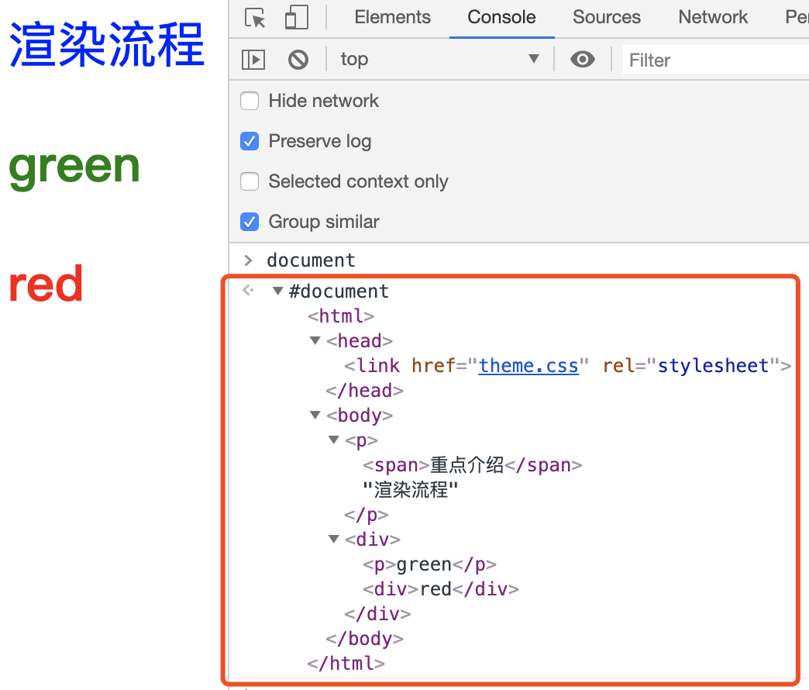
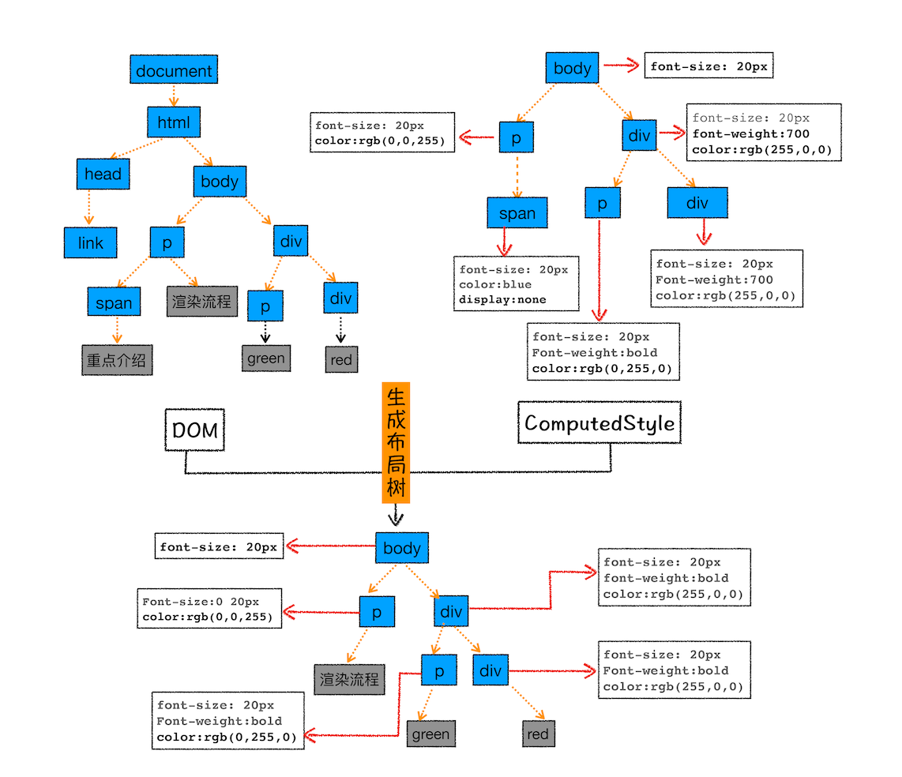
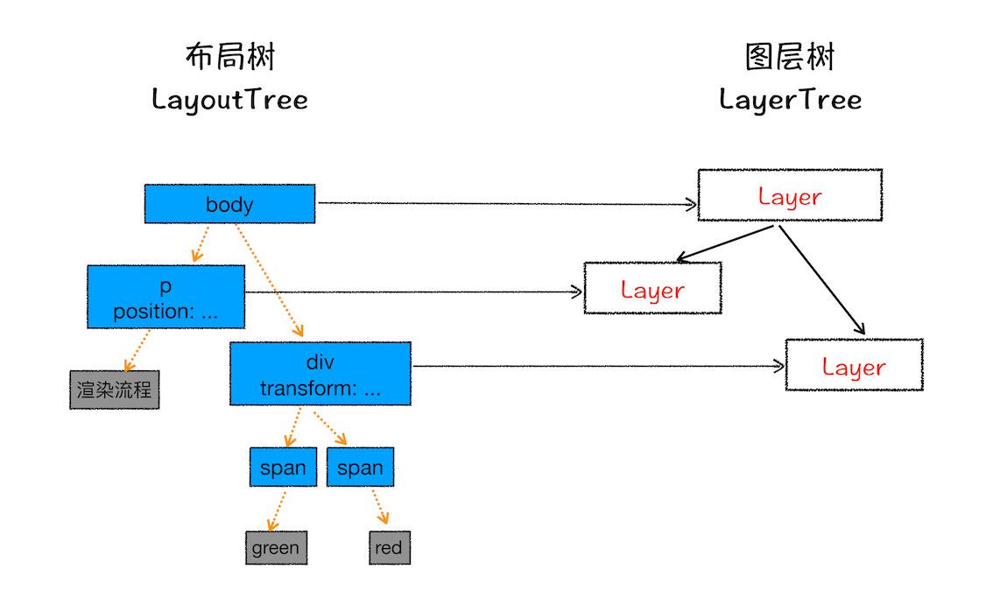

# 浏览器工作原理与时间

---

[TOC]
## 宏观视角下的浏览器


#### chrome架构：打开一个页面为什么有4个进程


#### TCP协议：如何保证页面文件能被完整送达浏览器？


#### HTTP请求流程：为什么很多站点第二次打开速度会很快？

#### 导航流程：从输入URL到页面展示，这中间发生了什么？

<br />

----
#### 渲染流程（上）：HTML、CSS和JavaScript，是如何变成页面的？

##### 构建DOM树

原因：将HTML转为浏览器可理解的结构——DOM树



通过 JavaScript修改DOM
```HTML
document.getElementsByTagName("p")[0].innerText = "black"
```


##### 样式计算
1. 把 CSS 转换为浏览器能够理解的结构 ———— StyleSheets，控制台输入`document.StyleSheets`可以查看


2. 转换样式表中的属性值，使其标准化 ———— 消除不同解析引擎的差异


3. 计算出 DOM 树中每个节点的具体样式


##### 布局阶段
现在，我们有 DOM 树和 DOM 树中元素的样式，但这还不足以显示页面，因为我们还不知道 DOM 元素的几何位置信息。那么接下来就`需要计算出 DOM 树中可见元素的几何位置`，我们把这个计算过程叫做`布局`。

> Chrome 在布局阶段需要完成两个任务：创建布局树和布局计算

1. 构建布局树 ———— 仅包含可见元素


2. 布局计算
根据上面构建的布局树，计算每个节点的坐标位置；


##### 小结


##### 思考题
> 给你留个思考题：如果下载 CSS 文件阻塞了，会阻塞 DOM 树的合成吗？会阻塞页面的显示吗？

作者回复: 借这里解答下留的题目：

当从服务器接收HTML页面的第一批数据时，DOM解析器就开始工作了，在解析过程中，如果遇到了JS脚本，如下所示：
<html>
    <body>
        极客时间
        <script>
        document.write("--foo")
        </script>
    </body>
</html>
那么DOM解析器会先执行JavaScript脚本，执行完成之后，再继续往下解析。

那么第二种情况复杂点了，我们内联的脚本替换成js外部文件，如下所示：
<html>
    <body>
        极客时间
        <script type="text/javascript" src="foo.js"></script>
    </body>
</html>
这种情况下，当解析到JavaScript的时候，会先暂停DOM解析，并下载foo.js文件，下载完成之后执行该段JS文件，然后再继续往下解析DOM。这就是JavaScript文件为什么会阻塞DOM渲染。

我们再看第三种情况，还是看下面代码：
```js
<html>
    <head>
        <style type="text/css" src = "theme.css" />
    </head>
    <body>
        <p>极客时间</p>
        <script>
            let e = document.getElementsByTagName('p')[0]
            e.style.color = 'blue'
        </script>
    </body>
</html>
```
当我在JavaScript中访问了某个元素的样式，那么这时候就需要等待这个样式被下载完成才能继续往下执行，所以在这种情况下，CSS也会阻塞DOM的解析。


所以JS和CSS都有可能会阻塞DOM解析，关于详细信息我们会在后面的章节中详细介绍。

<br />

---
#### 渲染流程（下）：HTML、CSS和JavaScript，是如何变成页面的？

##### 分层
> 为页面中有很多复杂的效果，如一些复杂的 3D 变换、页面滚动，或者使用 z-indexing 做 z 轴排序等，为了更加方便地实现这些效果，渲染引擎还需要为特定的节点生成专用的图层，并生成一棵对应的==图层树（LayerTree）==

> 要想直观地理解什么是图层，你可以打开 Chrome 的“开发者工具”，选择“Layers”标签，就可以可视化页面的分层情况

> 渲染引擎给页面分了很多图层，这些图层按照一定顺序叠加在一起，就形成了最终的页面

> 现在你知道了浏览器的页面实际上被分成了很多图层，这些图层叠加后合成了最终的页面。下面我们再来看看这些图层和布局树节点之间的关系，如文中图所示：



渲染引擎创建特定的图层需要满足以下两个条件之一：
- 拥有层叠上下文属性的元素会被提升为单独的一层：如定位属性{==z-index/position: absolute==}、定义透明属性的元素、使用css滤镜的元素（filter)
层叠上下文参考[该文章](https://developer.mozilla.org/zh-CN/docs/Web/CSS/CSS_Positioning/Understanding_z_index/The_stacking_context)
- 需要裁剪（clip）的地方也会被创建为图层：这里指的是在一个较小的块中需要展示的文本超过了块的可视区域，这时候就会发生，如下图所示


##### 图层绘制
渲染引擎会把图层的绘制拆分为多个小的绘制指令（如绘制点、线、矩形等），然后把这些指令按照顺序组成一个绘制列表；图层绘制阶段输出的是待绘制列表；


##### 栅格化操作
上面提到了图层绘制只是生成并输出待绘制列表，时机的绘制操作是由渲染引擎中的合成线程来完成的，绘制列表准备好后，会`commit`给合成线程；


合成线程首先会将图层划分为图块(`tile`)，然后将这些图块生成位图，生成位图的操作称为栅格化；视口附近的图会优先生成位图；

> 渲染进程维护了一个栅格化线程池，图块的栅格化操作都在线程池内运行；


通常，栅格化过程会使用GPU加速生成，称作GPU栅格化，生成的位图保存在GPU内存中；


##### 合成与显示
> 一旦所有图块都被光栅化，合成线程就会生成一个绘制图块的命令——“DrawQuad”，然后将该命令提交给浏览器进程。

> 浏览器进程里面有一个叫 viz 的组件，用来接收合成线程发过来的 DrawQuad 命令，然后根据 DrawQuad 命令，将其页面内容绘制到内存中，最后再将内存显示在屏幕上。

##### 小结


结合上图，一个完整的渲染流程大致可总结为如下：
1. 渲染进程将 HTML 内容转换为能够读懂的 DOM 树结构；
2. 渲染引擎将 CSS 样式表转化为浏览器可以理解的 styleSheets，计算出 DOM 节点的样式；
3. 创建布局树，并计算元素的布局信息。
4. 对布局树进行分层，并生成分层树。
5. 为每个图层生成绘制列表，并将其提交到合成线程。
6. 合成线程将图层分成图块，并在光栅化线程池中将图块转换成位图。
7. 合成线程发送绘制图块命令 DrawQuad 给浏览器进程。
8. 浏览器进程根据 DrawQuad 消息生成页面，并显示到显示器上。

###### 重绘


###### 重排


###### 直接合成阶段
渲染引擎将跳过布局和绘制，只执行后续的合成操作，我们把这个过程叫做合成。比如添加css3动画属性等；


##### 相关思考
###### 重绘重排与性能优化
减少重排重绘, 方法很多：
1. 使用 class 操作样式，而不是频繁操作 style
2. 避免使用 table 布局
3. 批量dom 操作，例如 createDocumentFragment，或者使用框架，例如 React
4. Debounce window resize 事件
5. 对 dom 属性的读写要分离
6. will-change: transform 做优化

###### 渲染流程补充


1. 渲染进程的合成线程执行图层合成（Layer Compositor）———— 是将多个`tile`合成一个图层
2. 合成的图层交给浏览器进程执行显示合成（Display Compositor）———— 将多个图层合成页面

---

## 浏览器中的JavaScript执行机制

#### 07 | 变量提升：JavaScript代码是按顺序执行的吗？

##### 变量提升
> 所谓的变量提升，是指在 JavaScript 代码执行过程中，JavaScript 引擎把变量的声明部分和函数的声明部分提升到代码开头的“行为”。变量被提升后，会给变量设置默认值，这个默认值就是我们熟悉的 undefined。


通过这段模拟的变量提升代码，相信你已经明白了可以在定义之前使用变量或者函数的原因——函数和变量在执行之前都提升到了代码开头。

##### JavaScript代码的执行流程

> 从概念的字面意义上来看，“变量提升”意味着变量和函数的声明会在物理层面移动到代码的最前面，正如我们所模拟的那样。但，这并不准确。`实际上变量和函数声明在代码里的位置是不会改变的，而且是在编译阶段被 JavaScript 引擎放入内存中`。对，你没听错，一段 JavaScript 代码在执行之前需要被 JavaScript 引擎编译，编译完成之后，才会进入执行阶段。大致流程你可以参考下图：


###### 编译阶段
编译阶段输入代码经过编译后会生成两部分 ———— `执行上下文`和`可执行代码`

`执行上下文是JavaScript执行一段代码的运行环境`比如调用一个函数，就会进入这个函数的执行上下文，确定该函数在执行期间用到的诸如 this、变量、对象以及函数等。

在执行上下文中存在一个变量环境的对象（Viriable Environment），该对象中保存了变量提升的内容。

```js

showName()
console.log(myname)
var myname = '极客时间'
function showName() {
    console.log('函数showName被执行');
}
```

以上面的代码为例，分析环境变量对象的生成过程；
1. 第 1 行和第 2 行，由于这两行代码不是声明操作，所以 JavaScript 引擎不会做任何处理；
2. 第 3 行，由于这行是经过 var 声明的，因此 JavaScript 引擎将在环境对象中创建一个名为 myname 的属性，并使用 undefined 对其初始化；
3. 第 4 行，JavaScript 引擎发现了一个通过 function 定义的函数，所以它将函数定义`存储到堆 (HEAP）`中，并在环境对象中创建一个 showName 的属性，然后将该属性值指向堆中函数的位置（不了解堆也没关系，JavaScript 的执行堆和执行栈我会在后续文章中介绍）。

生成的变量环境可以看做如下结构：
```
VariableEnvironment:
     myname -> undefined, 
     showName ->function : {console.log(myname)
```

生成变量环境对象后，JS引擎会将声明以外的代码编译为字节码，即可执行代码；
```js
showName()
console.log(myname)
myname = '极客时间'
```

###### 执行阶段
1. 当执行到 showName 函数时，JavaScript 引擎便开始在变量环境对象中查找该函数，由于变量环境对象中存在该函数的引用，所以 JavaScript 引擎便开始执行该函数，并输出“函数 showName 被执行”结果。
2. 接下来打印“myname”信息，JavaScript 引擎继续在变量环境对象中查找该对象，由于变量环境存在 myname 变量，并且其值为 undefined，所以这时候就输出 undefined。
3. 接下来执行第 3 行，把“极客时间”赋给 myname 变量，赋值后变量环境中的 myname 属性值改变为“极客时间”，变量环境如下所示：
```
VariableEnvironment: 
    myname -> "极客时间",
    showName ->function : {console.log(myname)
```

> 实际上，编译阶段和执行阶段都是非常复杂的，包括了`词法分析、语法解析、代码优化、代码生成`等，这些内容我会在《14 | 编译器和解释器：V8 是如何执行一段 JavaScript 代码的？》那节详细介绍，在本篇文章中你只需要知道 JavaScript 代码经过编译生成了什么内容就可以了

###### 关于同名变量和函数的处理原则
1. 如果是同名的函数，JavaScript编译阶段会选择最后声明的那个。

2. 如果变量和函数同名，那么在编译阶段，变量的声明会被忽略


##### 总结
1. JavaScript 代码执行过程中，需要先做变量提升，而之所以需要实现变量提升，是因为 JavaScript 代码在执行之前需要先编译。
2. 在编译阶段，变量和函数会被存放到变量环境中，变量的默认值会被设置为 undefined；在代码执行阶段，JavaScript 引擎会从变量环境中去查找自定义的变量和函数。
3. 如果在编译阶段，存在两个相同的函数，那么最终存放在变量环境中的是最后定义的那个，这是因为后定义的会覆盖掉之前定义的。

这节的主要目的是让你清楚`JavaScript 的执行机制：先编译，再执行`。

#### 扩展 ———— [Quick Tip: How to Declare Variables in JavaScript](https://www.sitepoint.com/how-to-declare-variables-javascript/)


###### Declaration
在指定的作用域内声明一个变量

###### Initialization
为变量分配内存：当你声明一个变量时，它会自动初始化，JavaScript引擎会为该变量分配内存

###### Assignment
为变量赋值


##### var

起始于JavaScript创建，作用于全局作用域和函数作用域

```js
var x; // Declaration and initialization
x = "Hello World"; // Assignment

// Or all in one
var y = "Hello World";
```

##### let

ES6引入`let`和`const`，用于降低`var`声明的缺陷（容易造成变量值难以确定及变量污染），作用域增加了块级作用域；

```js
let x; // Declaration and initialization
x = "Hello World"; // Assignment

// Or all in one
let y = "Hello World";
```

Demo说明
```js
var name = "Peter";
if(name === "Peter"){
  let hello = "Hello Peter";
} else {
  let hello = "Hi";
}
console.log(hello); // ReferenceError: hello is not defined


var name = "Peter";
if(name === "Peter"){
  let hello = "Hello Peter";
  console.log(hello);
} else {
  let hello = "Hi";
  console.log(hello); // 正常运行
}
```

##### const

> const用于声明一个常量，即在声明时赋值但不能在函数结束运行前改变它的值，否则会报错；
```js
const x = 'Hello World';
```

##### 意外的全局创建
如果你在赋值前忘记声明该变量，该变量就会被创建为全局变量；为了避免这种情况，可以开启严格模式`use strict`;
```js
function sayHello(){
  hello = "Hello World";
  return hello;
}
sayHello();
console.log(hello); // Hello World
```

##### 变量提升和暂时性死区（Hoisting and Temperal Dead Zone）

> `var`与`let/const`的另一个区别是变量提升，`let/const`不存在变量提升，但存在暂时性死区

变量声明将始终在内部被提升(移动)到当前作用域的顶部，是全局作用域和函数作用域

在声明前访问一个`var`变量会返回`undefined`，这是在初始化的时候赋值的

在声明前访问一个`let/const`变量会报错，在进入变量的作用域和到达其声明之间的这段时间被称为`暂时性死区`，该时间段内变量不可访问


<br />

#### 08 | 调用栈：为什么JavaScript代码会出现栈溢出？

> JavaScript执行过程中可能存在多个执行上下文（Excution Context），JS引擎是通过栈来管理这些EC，称作`调用栈`

```js
var a = 2
function add(b,c){
  return b+c
}
function addAll(b,c){
var d = 10
result = add(b,c)
return  a+result+d
}
addAll(3,6)
```


> 调用栈是 JavaScript 引擎追踪函数执行的一个机制，当一次有多个函数被调用时，通过调用栈就能够追踪到哪个函数正在被执行以及各函数之间的调用关系。


执行时各EC会依次出栈


##### 开发中利用好调用栈
###### 利用浏览器查看调用栈的信息
打开“开发者工具”，点击“Source”标签，选择 JavaScript 代码的页面，然后在第 3 行加上断点，并刷新页面。你可以看到执行到 add 函数时，执行流程就暂停了，这时可以通过右边“call stack”来查看当前的调用栈的情况，如下图：


> 另外，可以通过`console.trace()进行控制台输出函数调用关系


##### 栈溢出
调用栈是有大小的，当栈中的执行上下文超过一定数目时就会造成JS引擎报错，称为栈溢出


##### 总结
1. 每调用一个函数，JavaScript 引擎会为其创建执行上下文，并把该执行上下文压入调用栈，然后 JavaScript 引擎开始执行函数代码。
2. 如果在一个函数 A 中调用了另外一个函数 B，那么 JavaScript 引擎会为 B 函数创建执行上下文，并将 B 函数的执行上下文压入栈顶。
3. 当前函数执行完毕后，JavaScript 引擎会将该函数的执行上下文弹出栈。
4. 当分配的调用栈空间被占满时，会引发“堆栈溢出”问题。


<br />

##### 09 | 块级作用域：var缺陷以及为什么要引入let和const？


---
#### 作者推荐学习资料
1. 前端资料
    - [Web Fundamentals ](https://developers.google.com/web/fundamentals/)
    - [MDN 文档](https://developer.mozilla.org/zh-CN/)

2. Chromium 资料和源码
    - [Chromium docs](https://chromium.googlesource.com/chromium/src/+/master/docs/README.md)
    - [Chromium 源码](https://chromium.googlesource.com/chromium/src)

3. Stackoverflow 社区
    - [stackoverflow](https://stackoverflow.com/)

4. 视频推荐
    - [BlinkOn](https://www.youtube.com/channel/UCIfQb9u7ALnOE4ZmexRecDg)
    - [Google Chrome Developers](https://www.youtube.com/channel/UCnUYZLuoy1rq1aVMwx4aTzw)

---